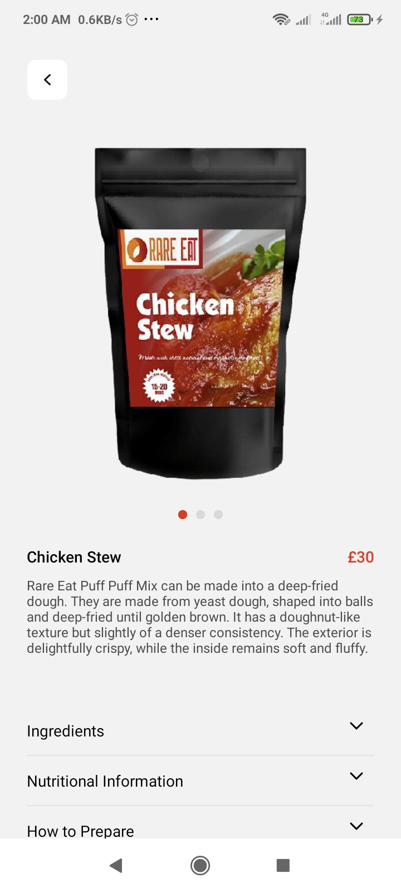

# Tobams Group Frontend Dev Assessment
This React Native app implements screens for a food ordering application.

## Table of Contents
- [Overview](#overview)
- [Features](#features)
- [Built with](#built-with)
- [Getting Started](#getting-started)
  - [Prerequisites](#prerequisites)
  - [Installation](#installation)
- [Usage](#usage)
- [Screenshots](#screenshots)
- [LICENSE](#license)

## Overview
The app consists of three screens, which include: the menu, dish screen and cart screen. The user navigates from the menu to the dish and cart screens by clicking on items in the menu and using tabs at the bottom of the screen.

## Features
- Users can see a list of dishes to order.
- Users can view more information about a particular dish.
- Users can add a dish to cart and specify the amount being ordered.
- Users can view dishes in the order and edit the quantity or delete them entirely.
- Users can checkout their order.

## Built with
- React Native.
- Expo.
- Expo router.
- ReduxJS.

## Getting Started
### Prerequisites
- Node.js LTS release.
- Git (for source control).

### Installation
Clone the repository and install dependencies.

```bash
git clone https://github.com/peter-abah/tobams-assessment.git
cd tobams-assessment
npm install
```

You have also install **Expo Go** app on your mobile device to preview during development.

## Usage
Start the development server and scan the QR code shown with the **Expo Go** app.

```bash
npx expo start
```

## Screenshots
These screenshots are from a mobile device.
### Menu


### Dish Screen


### Cart Screen


## LICENSE
This project is licensed under the [MIT LICENSE](./LICENSE).
